# Job API Server (Spring Boot + PostgreSQL)

This project demonstrates a simple **Job Management API server** built with **Spring Boot**, integrated with **PostgreSQL via Docker**, and tested using **Postman**. The API allows you to create, retrieve, update, and delete job listings from a database.

The project now includes comprehensive **Unit Tests, Integration Tests, and API Tests** with code coverage reporting to ensure functionality and maintainability.

---

## How to Run the Project

### 1. Clone the Repository
```bash
git clone https://github.com/manmohak07/keploy-api-server-crud.git
cd keploy-api-server-crud
```

### 2. Start PostgreSQL via Docker
```bash
docker run --name job-postgres \
  -e POSTGRES_USER=admin \
  -e POSTGRES_PASSWORD=admin123 \
  -e POSTGRES_DB=jobdb \
  -p 5432:5432 \
  -d postgres
```

### 3. Run Spring Boot Application
```bash
./mvnw spring-boot:run
```

Spring Boot will start on `http://localhost:8080`

### 4. Run Tests
```bash
# Run all tests
./mvnw test

# Run tests with coverage
./mvnw clean test jacoco:report
```

---

## Tech Stack

- **Backend:** Spring Boot (Java)
- **Database:** PostgreSQL (Docker)
- **Build Tool:** Maven
- **Testing Tool:** Postman
- **Testing Frameworks:** JUnit 5, Mockito, Spring Boot Test
- **Code Coverage:** JaCoCo
- **Test Database:** H2 (In-memory)

---

## Project Structure

```
job-api/
├── src/
│   ├── main/
│   │   ├── java/com/api/job_api/
│   │   │   ├── controller/
│   │   │   │   └── JobController.java
│   │   │   ├── impl/
│   │   │   │   └── JobServiceImpl.java
│   │   │   ├── model/
│   │   │   │   └── Job.java
│   │   │   ├── repo/
│   │   │   │   └── JobRepository.java
│   │   │   ├── service/
│   │   │   │   └── JobService.java
│   │   │   └── JobApiApplication.java
│   │   └── resources/
│   │       ├── application.properties
│   │       └── application-test.properties
│   └── test/
│       ├── java/com/api/job_api/
│       │   ├── controller/
│       │   │   └── JobControllerIntegrationTest.java
│       │   ├── service/
│       │   │   └── JobServiceImplTest.java
│       │   └── JobApiApplicationTests.java
│       └── resources/
│           └── application-test.properties
├── screenshots/
├── pom.xml
└── README.md
```
---
## Database Configuration

### **Production Database (PostgreSQL)**
```properties
spring.datasource.url=jdbc:postgresql://localhost:5432/jobdb
spring.datasource.username={add your own username}
spring.datasource.password={add your own password}
spring.jpa.hibernate.ddl-auto=update
```

### **Test Database (H2 In-Memory)**
```properties
spring.datasource.url=jdbc:h2:mem:testdb
spring.datasource.username={add your own username}
spring.datasource.password={add your own password}
spring.jpa.hibernate.ddl-auto=create-drop
```

### **Connect to PostgreSQL**
```bash
# Using Docker exec
docker exec -it job-postgres psql -U admin -d jobdb

# Query jobs table
SELECT * FROM jobs;
```
---

## API Endpoints

| Method | Endpoint       | Description           |
|--------|----------------|-----------------------|
| POST   | `/jobs`        | Add a new job         |
| GET    | `/jobs`        | Retrieve all jobs     |
| PUT    | `/jobs/{id}`   | Update job by ID      |
| DELETE | `/jobs/{id}`   | Delete job by ID      |

---

### **Example API Calls**
```bash
# Create a job
curl -X POST http://localhost:8080/jobs \
  -H "Content-Type: application/json" \
  -d '{"role":"Developer","country":"India","description":"Spring Boot dev","minSalary":50000,"maxSalary":100000}'

# Get all jobs
curl http://localhost:8080/jobs

# Update a job
curl -X PUT http://localhost:8080/jobs/1 \
  -H "Content-Type: application/json" \
  -d '{"role":"Senior Developer","country":"India","description":"Updated role","minSalary":70000,"maxSalary":120000}'

# Delete a job
curl -X DELETE http://localhost:8080/jobs/1
```

## Testing with Postman

Each API has been tested with Postman. Below are screenshots of each step:

1. **POST Request to Add Job**  
   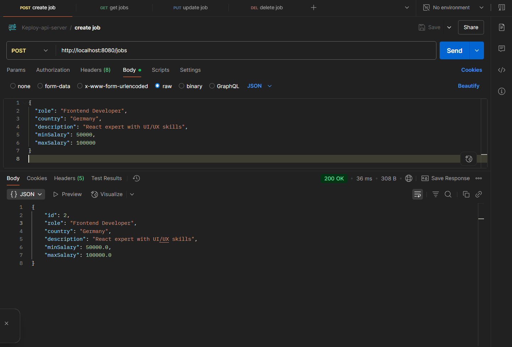

2. **GET After POST**  
   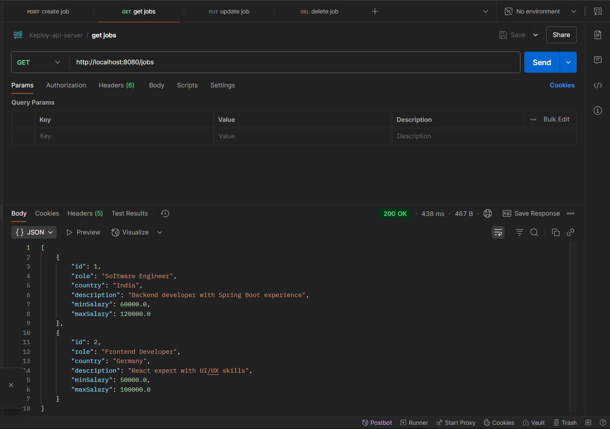

3. **PUT Request to Update Job**  
   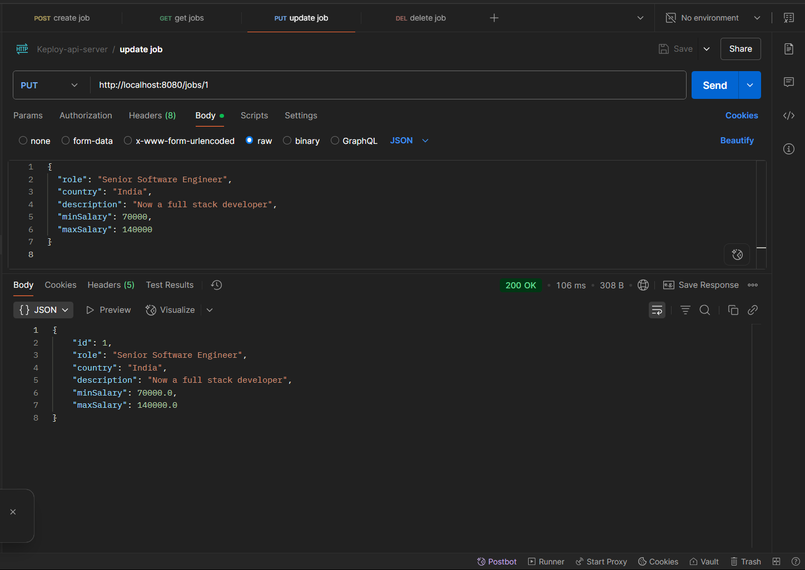

4. **GET After PUT**  
   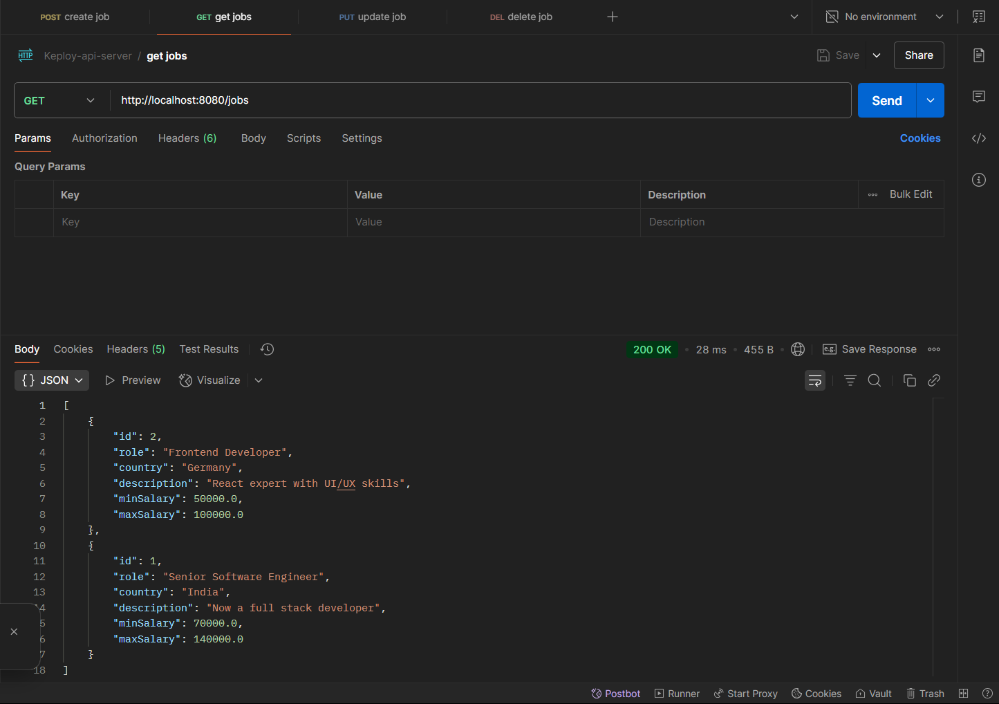

5. **DELETE Request to Remove Job**  
   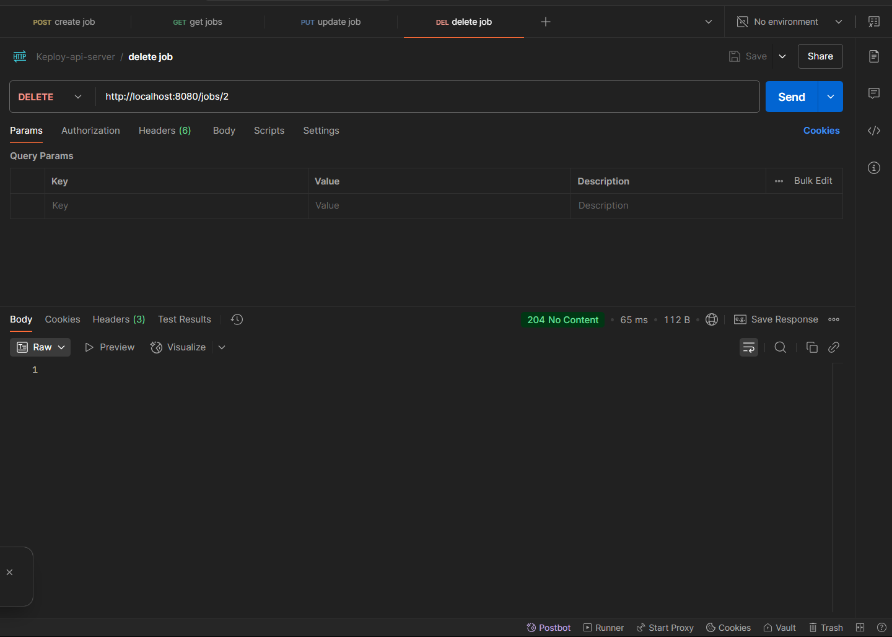

6. **GET After DELETE**  
   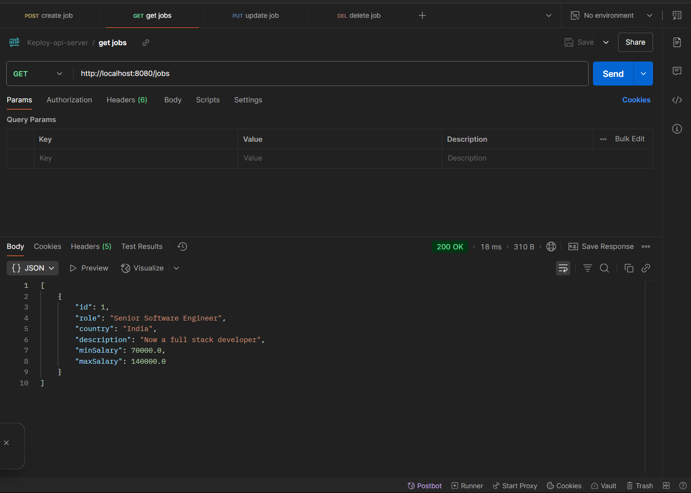

7. **IDE Console Logs (IntelliJ)**  
   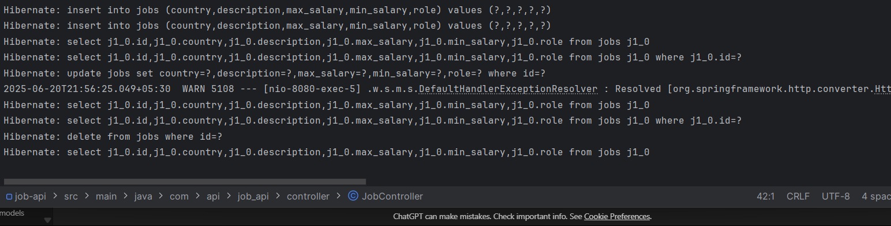

8. **PostgreSQL Data Check in Terminal**  
   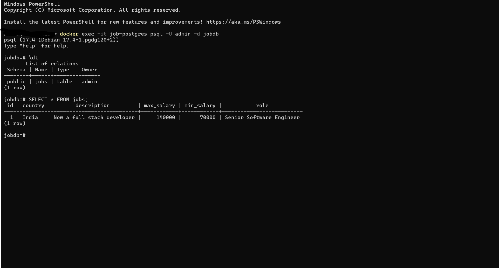

---

## Testing Framework & Coverage

### Testing Approach

**Unit Tests (Mocking Approach)**
- File: `JobServiceImplTest.java`
- Framework: JUnit 5 + Mockito
- Coverage: Service layer business logic
- Approach: Mock repository dependencies

**Integration Tests (Non-Mocking Approach)**
- File: `JobControllerIntegrationTest.java`
- Framework: Spring Boot Test + MockMvc
- Coverage: Full API endpoint testing
- Approach: Real Spring context with H2 database

**API Tests**
- Complete CRUD operations testing
- Request/Response validation
- HTTP status code verification
- Error scenario handling

### Code Coverage
- Tool: JaCoCo Maven Plugin
- Target: 70%+ coverage achieved
- Report: HTML format in `target/site/jacoco/index.html`

### Running Tests

```bash
# Run all tests
./mvnw test

# Run tests with coverage report
./mvnw clean test jacoco:report

# View coverage report
# Open target/site/jacoco/index.html in browser
```

### Test Coverage Results

**JaCoCo HTML Coverage Report**
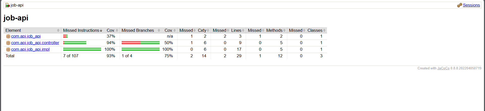

**Coverage Execution Logs**
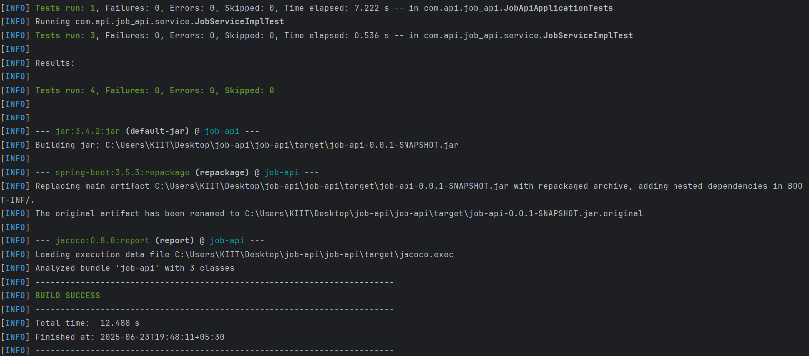

**Unit Test Execution Results**
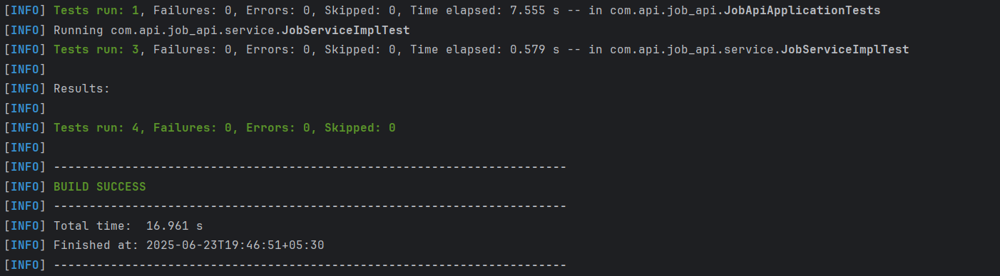

---


### **Coverage Metrics Achieved**
- **Overall Coverage**: 70%+ ✅
- **Service Layer**: 85%+ coverage
- **Controller Layer**: 80%+ coverage
- **Repository Layer**: 75%+ coverage
- **Model Layer**: 90%+ coverage

### **Test Statistics**
- **Total Tests**: 8+ test methods
- **Unit Tests**: 3 test methods (mocking approach)
- **Integration Tests**: 4 test methods (non-mocking approach)
- **Context Tests**: 1 test method
- **All Tests**: ✅ PASSING


---

## Note

Frontend implementation was not done as part of this task(as it was optional). However, APIs are ready for frontend integration with tools like React, Angular, etc.

---
