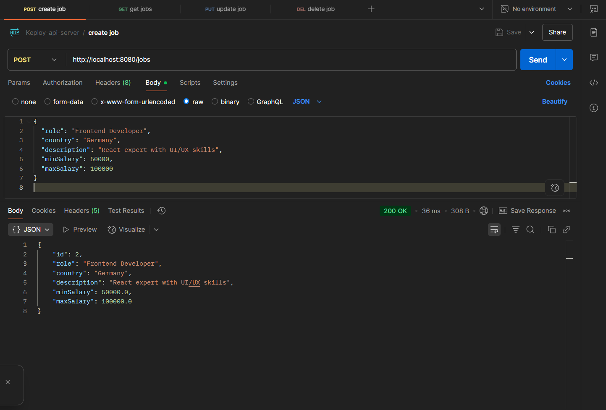
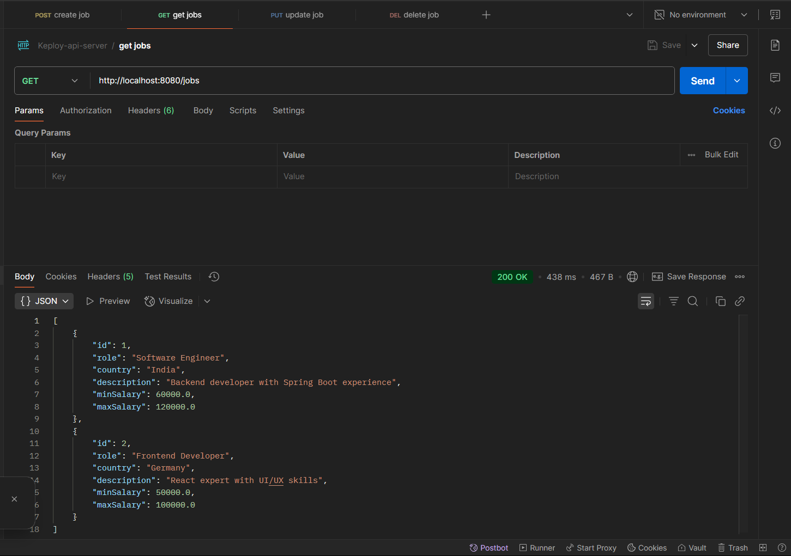
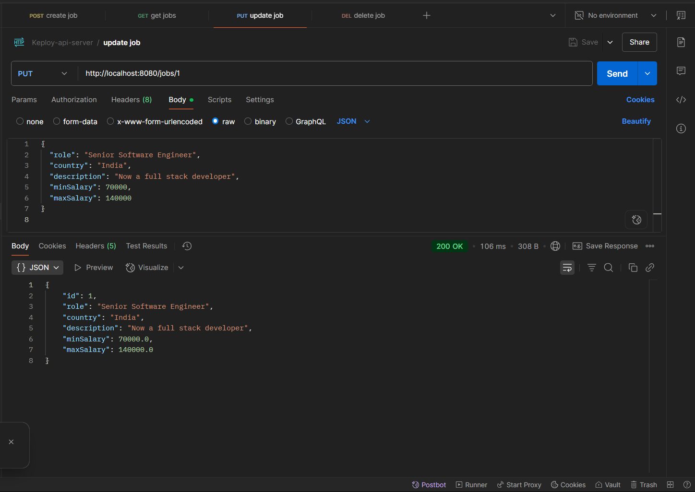
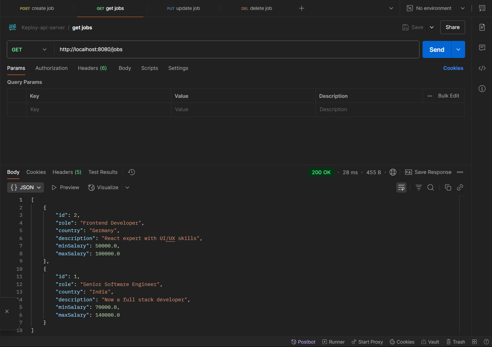
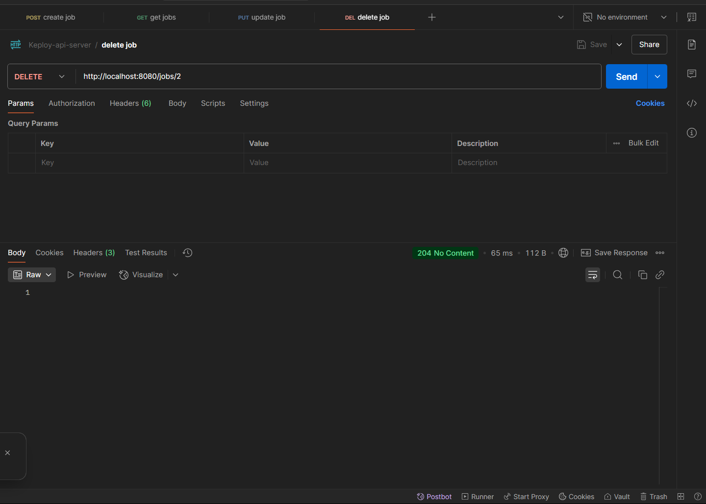
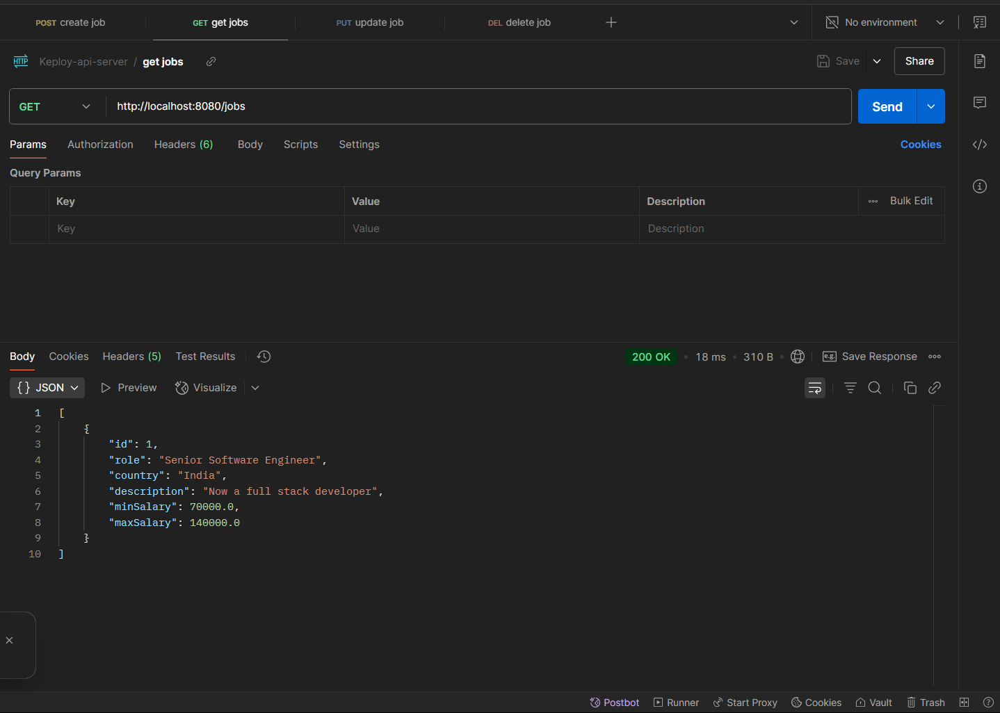
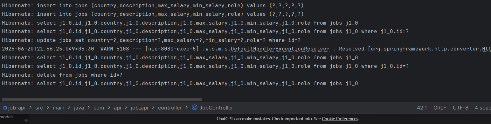
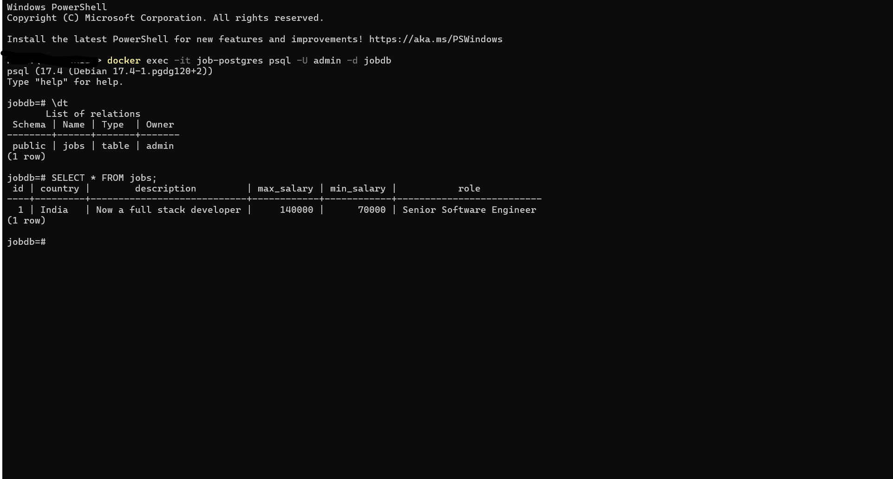

# 📌 Job API Server - Spring Boot + PostgreSQL

This project demonstrates a simple **Job Management API server** built with **Spring Boot**, integrated with **PostgreSQL via Docker**, and tested using **Postman**. The API allows you to create, retrieve, update, and delete job listings from a database.

---

## ✅ Task Objective

This project was created as part of a hands-on assignment to:

- Design and implement at least **4 custom API endpoints**.
- Integrate with a **PostgreSQL** database using Docker.
- (Optional) Add a frontend to interact with the APIs.
- Test the API with tools like **Postman** and document the development process.

---

## 📂 Tech Stack

- **Backend:** Spring Boot (Java)
- **Database:** PostgreSQL (Docker)
- **Build Tool:** Maven
- **Testing Tool:** Postman

---

## 📁 Project Structure

```
job-api/
├── controller/
│   └── JobController.java
├── impl/
│   └── JobServiceImpl.java
├── model/
│   └── Job.java
├── repo/
│   └── JobRepository.java
├── service/
│   └── JobService.java
├── resources/
│   └── application.properties
├── JobApiApplication.java
├── pom.xml
```

---

## 🐳 PostgreSQL Docker Setup

To start PostgreSQL using Docker:

```bash
docker run --name job-postgres \
  -e POSTGRES_USER=admin \
  -e POSTGRES_PASSWORD=admin123 \
  -e POSTGRES_DB=jobdb \
  -p 5432:5432 \
  -d postgres
```

This spins up a PostgreSQL container accessible at `localhost:5432`.

---

## 🧩 Files of Interest

- `Job.java`: Entity representing a job record
- `JobRepository.java`: JPA repository
- `JobService.java`: Interface declaring service methods
- `JobServiceImpl.java`: Service logic implementation
- `JobController.java`: API endpoints implementation
- `application.properties`: Database config
- `pom.xml`: Maven dependencies and Spring Boot setup

---

## 📬 API Endpoints

| Method | Endpoint       | Description           |
|--------|----------------|-----------------------|
| POST   | `/jobs`        | Add a new job         |
| GET    | `/jobs`        | Retrieve all jobs     |
| PUT    | `/jobs/{id}`   | Update job by ID      |
| DELETE | `/jobs/{id}`   | Delete job by ID      |

---

## 🧪 Testing with Postman

Each API has been tested with Postman. Below are screenshots of each step:

1. **POST Request to Add Job**  
   

2. **GET After POST**  
   

3. **PUT Request to Update Job**  
   

4. **GET After PUT**  
   

5. **DELETE Request to Remove Job**  
   

6. **GET After DELETE**  
   

7. **IDE Console Logs (IntelliJ)**  
   

8. **PostgreSQL Data Check in Terminal**  
   

---

## 🏃‍♂️ How to Run the Project

### 1. Clone the Repository
```bash
git clone https://github.com/your-username/keploy-api-server-crud.git
cd job-api
```

### 2. Start PostgreSQL via Docker
```bash
docker run --name job-postgres \
  -e POSTGRES_USER=admin \
  -e POSTGRES_PASSWORD=admin123 \
  -e POSTGRES_DB=jobdb \
  -p 5432:5432 \
  -d postgres
```

### 3. Run Spring Boot Application
```bash
./mvnw spring-boot:run
```

Spring Boot will start on `http://localhost:8080`

---

## 🧾 Database Details

- **URL:** `jdbc:postgresql://localhost:5432/jobdb`
- **Username:** `admin`
- **Password:** `admin123`

You can connect to the DB using psql CLI:
```bash
docker exec -it job-postgres psql -U admin -d jobdb
```
Then:
```sql
SELECT * FROM jobs;
```

---

## 📄 Optional Frontend

Frontend implementation was not done as part of this task. However, APIs are ready for frontend integration with tools like React, Angular, etc.

---

## 📌 Summary

- ✅ 4 Custom CRUD API endpoints
- ✅ PostgreSQL integration via Docker
- ✅ End-to-end testing via Postman
- ✅ Screenshots and command logs documented
- ✅ GitHub project with clean structure and documentation

---

Let me know if you’d like help with a frontend or CI setup next!
